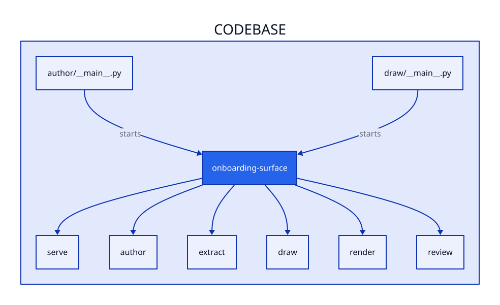

# Architecture

<!-- onboarding-surface:begin codemap -->

| module | what it does | grep for |
| --- | --- | --- |
| serve | Exposes pipeline operations as stateless remote A2A skills | `serve/__main__.py` |
| author | Runs governed LLM calls over facts to produce prose and landmines | `author/__main__.py` |
| extract | Extracts deterministic repository facts into `facts.json` | `extract/__main__.py` |
| draw | Produces D2 architecture sketches and visual mark proposals | `draw/__main__.py` |
| render | Renders repository facts and authored prose into documentation files | `render/__main__.py` |
| review | Serves a read-only human-in-the-loop review interface | `review/__main__.py` |
<!-- onboarding-surface:end codemap -->

<!-- onboarding-surface:begin landmines -->
None extracted. Sources checked: lint configs, revert history, review comments, agent docs.
<!-- onboarding-surface:end landmines -->
