# Architecture

```mermaid
flowchart TD
  a2a_counterpart["a2a_counterpart/"]
  apps_script_surface["apps-script-surface/"]
  benchmarks["benchmarks/"]
  cloud_run_renderer["cloud-run-renderer/"]
  components["components/"]
  examples["examples/"]
  googlechat["googlechat/"]
  knowledge_catalogue["knowledge-catalogue/"]
  a2a_counterpart_main_py(["a2a_counterpart/main.py"])
  cloud_run_renderer_server_py(["cloud-run-renderer/server.py"])
```

<!-- onboarding-surface:begin codemap -->

| area | what it does | grep for |
|---|---|---|
| `atoms/schema.yaml` | the source of truth — every atom's type, fields, surfaces, stage | `- type:` |
| `scripts/gen_*.py` | generators; each reads `schema.yaml` and writes one artifact | `def main` |
| `renderers/a2ui_v1.py` | the Python reference renderer; `.gs`/`.html` mirrors stay deep-equal | `def render` |
| `ops/` | **private tier — not in a public clone.** `ops.py` + `project.yaml` (78 processes) | — |
| `public/` | generated output, deployed to a2uicatalog.ai; every file traces to a `policy.published` rule | — |
<!-- onboarding-surface:end codemap -->

<!-- onboarding-surface:begin landmines -->
- git history flags: `28c95836 Refresh stale generated agent-facing docs (#52)` *(source: commit message — verify relevance)*
- git history flags: `d1e48a3d Add orphaned-component-update warning (Gemini's DX recommendation on agent_sketchpad)` *(source: commit message — verify relevance)*
- git history flags: `f167f7eb Add agent_sketchpad: a new real catalogue atom for progressive multi-stroke drawing over real streaming updates` *(source: commit message — verify relevance)*

- **Deployed ≠ reachable.** The characteristic failure is a correct build that isn't live at the surface a user touches (six recorded). After any deploy, run the matching `*-verify` process. *(source: CLAUDE.md)*
- **Two failures on one symptom → STOP.** Report what you observed / ruled out / need. *(CLAUDE.md)*
- **Never track the private tier** — `ops/`, `**/Code.private.gs`, `.clasp.json`; the manifest audit fails otherwise. *(CLAUDE.md)*
- **Commit via `python3 ops/ops.py commit`** (sync-window stamping), push via `ops.py run repo-publish` — and both are unreachable from a public clone.
<!-- onboarding-surface:end landmines -->
